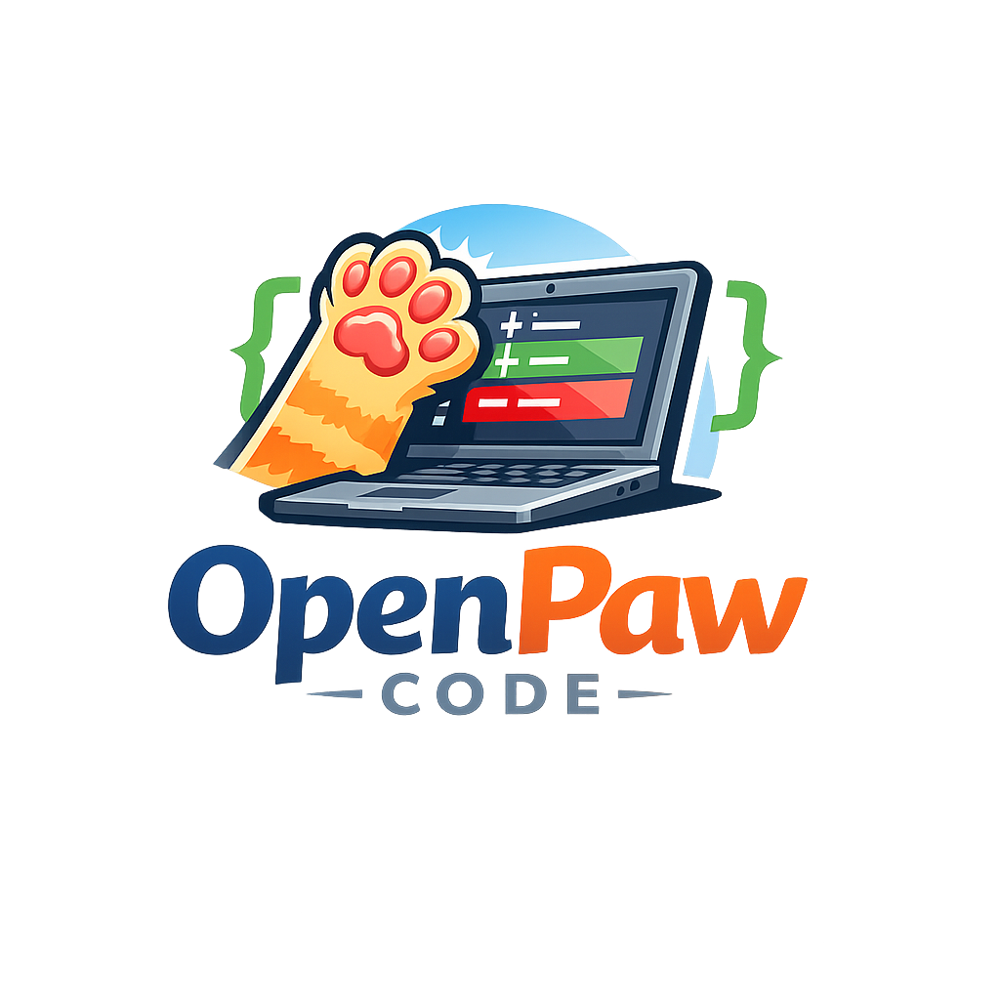

# OpenPaw Code 🐾



> **「LLMは diff を作るだけ、実行権は Controller が持つ」**

ローカルで動作する、安全なAIコーディングエージェント。

## 特徴

- 🔒 **安全第一** — SSH鍵なし・root権限なし・.env読み取り禁止
- 🎯 **純粋関数としてのLLM** — 入力(コード+指示) → 出力(SEARCH/REPLACE ブロック) のみ
- 🐳 **Dockerサンドボックス** — テストはネットワーク遮断・読み取り専用
- 👤 **人間承認** — パッチ適用前に必ずユーザーが確認
- 🔁 **自動再試行** — テスト失敗時にLLMへフィードバックして再生成

## インストール

```bash
git clone https://github.com/AideaHandesen-dvs/openpaw-code
cd openpaw-code
pip install -e .
```

Ollama を使う場合:
```bash
ollama pull qwen3:8b
```

## 使い方

## Quick Start

```bash
git clone https://github.com/AideaHandesen-dvs/OpenPaw-Code.git
cd OpenPaw-Code
python3 -m venv .venv
source .venv/bin/activate
pip install -r requirements.txt
cp .env.example .env
vim .env
python main.py "Add a hello world function"
```

### バグ修正

```bash
openpaw fix "src/calculator.py の除算でゼロ除算エラーが出る。修正して" \
  --repo ./myproject
```

### テスト作成

```bash
openpaw fix "src/parser.py の単体テストを tests/ に追加して" \
  --repo ./myproject \
  --files src/parser.py
```

### 許可ファイル一覧を確認

```bash
openpaw list-files --repo ./myproject
```

### オプション

| オプション | 説明 | デフォルト |
|---|---|---|
| `--repo` | 対象リポジトリのパス | `.` |
| `--config` | 設定ファイルのパス | `config.yaml` |
| `--files` | 読み込むファイルを明示指定 | (ホワイトリスト全体) |
| `--test-cmd` | テストコマンド | `python -m pytest tests/ -v --tb=short` |
| `--max-iter` | 最大試行回数 | `5` |
| `--yes` / `-y` | 承認プロンプトをスキップ | `False` |

## 設定 (config.yaml)

```yaml
llm:
  provider: ollama        # "ollama" または "openai"
  model: qwen3:8b
  base_url: http://localhost:11434

sandbox:
  docker_image: python:3.12-slim
  network_disabled: true
  timeout_seconds: 300

repository:
  allowed_paths:
    - src/
    - tests/
    - README.md
  denied_patterns:
    - "*.env"
    - "*.key"
```

OpenAI を使う場合:
```yaml
llm:
  provider: openai
  model: gpt-4o
```

```bash
export OPENAI_API_KEY=sk-...
```

## アーキテクチャ

```
User
  ↓
Controller
  ├─ Repository Reader  (ホワイトリスト方式でファイル読み取り)
  ├─ Prompt Builder     (SEARCH/REPLACE ブロック生成専用プロンプト)
  ├─ LLM Adapter        (Ollama / OpenAI)
  ├─ Diff Validator     (フォーマット・危険パターン・スコープ検査)
  ├─ Patch Applier      (文字列置換 / ロールバック対応)
  ├─ Test Runner        (Docker サンドボックス)
  └─ Session Manager    (履歴・パッチファイル保存)
```

## セキュリティ要件

| 要件 | 実装 |
|---|---|
| root権限禁止 | Docker `--user 1000:1000` |
| SSH鍵非使用 | SEARCH/REPLACE による直接置換のみ使用 |
| .env読み取り禁止 | `denied_patterns` でブロック |
| ホワイトリスト方式 | `allowed_paths` 外はアクセス不可 |
| ネットワーク遮断 | Docker `--network=none` |
| タイムアウト | `timeout_seconds` 設定 |

## テスト実行

```bash
pip install -e ".[dev]"
pytest tests/ -v
```

## ライセンス

MIT License

